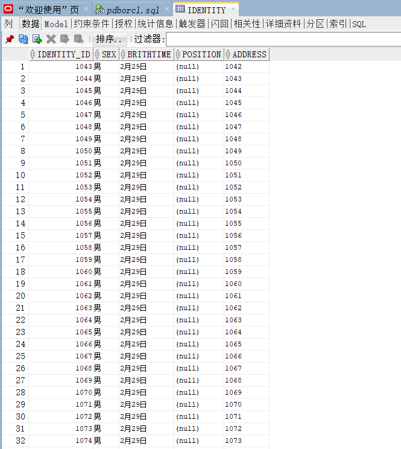
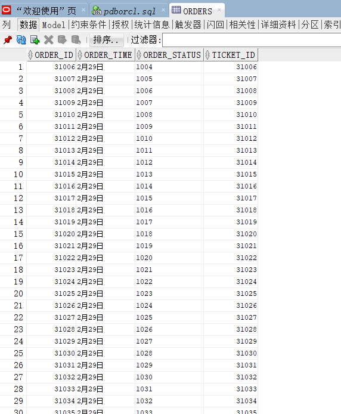
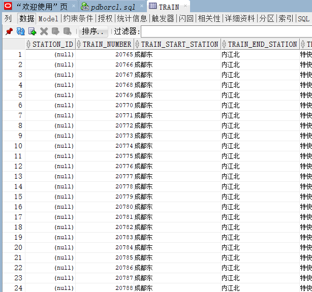
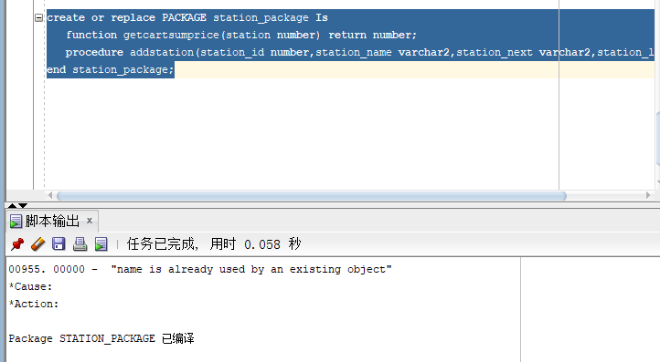
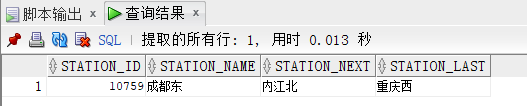
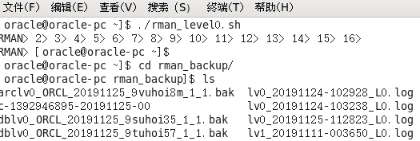
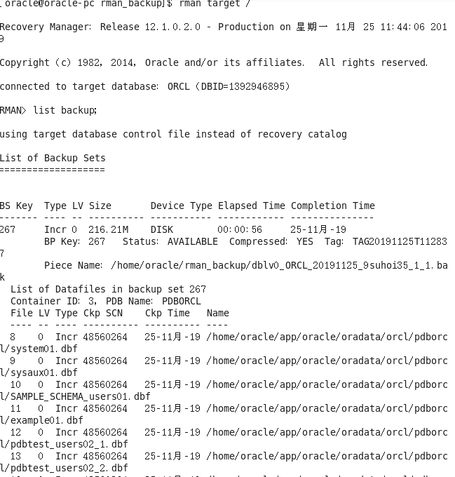

## 1.创建表空间

```mysql
create TABLESPACE ticket
datafile 'f:\oracle\ticket' size 50m
autoextend on next 50m maxsize 100m;

create TABLESPACE statioin
datafile 'f:\oracle\station' size 50m
autoextend on next 50m maxsize 100m;
```

## 2.创建用户

```mysql
create user ticket IDENTIFIED by ticket
DEFAULT TABLESPACE ticket;

create user statioin IDENTIFIED by statioin
DEFAULT TABLESPACE statioin;
```


## 3.授权用户

```mysql
grant all PRIVILEGES to ticket;
grant all PRIVILEGES to statioin;
```


### 4.创建管理员工和旅客角色

```mysql
create role traveller IDENTIFIED by traveller;
create role staff IDENTIFIED by staff;
```


## 5.创建表

```mysql
CREATE TABLE identity (
  identity_id integer NOT NULL PRIMARY KEY ,
  sex varchar(255) DEFAULT NULL,
  brithtime varchar(255) DEFAULT NULL,
  position varchar(255) DEFAULT NULL,
  address varchar(255) DEFAULT NULL
  )tablespace ticket


CREATE TABLE orders (
  order_id integer NOT NULL PRIMARY KEY ,
  order_time varchar(255) DEFAULT NULL,
  order_status varchar(255) DEFAULT NULL,
  ticket_id integer DEFAULT NULL
)tablespace ticket


CREATE TABLE station (
  station_id integer NOT NULL ,
  station_name varchar(255) DEFAULT NULL,
  station_next varchar(255) DEFAULT NULL,
  station_last varchar(255) DEFAULT NULL,
  PRIMARY KEY (station_id)
)tablespace ticket


CREATE TABLE ticket (
  ticket_id integer NOT NULL,
  train_number integer DEFAULT NULL,
  ticket_level integer DEFAULT NULL,
  PRIMARY KEY (ticket_id)
)tablespace ticket


CREATE TABLE train (
  station_id integer DEFAULT NULL,
  train_number integer NOT NULL,
  train_start_station varchar(255) DEFAULT NULL,
  train_end_station varchar(255) DEFAULT NULL,
  train_type varchar(255) DEFAULT NULL,
  PRIMARY KEY (train_number)
)tablespace ticket


CREATE TABLE traveller (
  user_id integer NOT NULL,
  order_id integer DEFAULT NULL,
  user_brith varchar(255) DEFAULT NULL,
  user_phone varchar(255) DEFAULT NULL,
  PRIMARY KEY (user_id)
)tablespace ticket
```


## 6.创建索引

create sequence seq_newIndex increment by 1 start with 1 maxvalue 999999999;

## 7.创建插入数据的存储过程并且运行

```mysql
create or replace
PROCEDURE insertidentity as
flag number;
begin
    flag:=0;
    for i in 1..10000
        loop
            insert into identity(identity_id,sex,brithtime,address)
            values(seq_newIndex.nextval,'男','2月29日',flag);
            flag:=flag+1;
            if flag=10001 then 
                commit;
            end if;
        end loop;
end;

create or replace
PROCEDURE insertorders as
flag number;
begin
    flag:=0;
    for i in 1..10000
        loop
            insert into orders(order_id,order_time,order_status,ticket_id)
            values(seq_newIndex.nextval,'2月29日',flag,seq_newIndex.nextval);
            flag:=flag+1;
            if flag=10001 then 
                commit;
            end if;
        end loop;
end;

create or replace
PROCEDURE insertstation as
flag number;
begin
    flag:=0;
    for i in 1..10000
        loop
            insert into station(station_id,station_name,station_next,station_last)
            values(seq_newIndex.nextval,'成都东','内江北','广州南');
            flag:=flag+1;
            if flag=10001 then 
                commit;
            end if;
        end loop;
end;


create or replace
PROCEDURE insertticket as
flag number;
begin
    flag:=0;
    for i in 1..10000
        loop
            insert into ticket(ticket_id,ticket_level)
            values(seq_newIndex.nextval,1);
            flag:=flag+1;
            if flag=10001 then 
                commit;
            end if;
        end loop;
end;

create or replace
PROCEDURE inserttrain as
flag number;
begin
    flag:=0;
    for i in 1..10000
        loop
            insert into train(train_number,train_start_station,train_end_station,train_type)
            values(seq_newIndex.nextval,'成都东','内江北','特快');
            flag:=flag+1;
            if flag=10001 then 
                commit;
            end if;
        end loop;
end;
```


```mysql
call insertidentity();
call insertstation();
call inserttrain();
call insertticket();
call insertorders();
```







## 8.创建包和以及内部存储过程

```mysql
create or replace PACKAGE station_package Is
   function getstation(station_id number) return number;
   procedure addstation(station_id number,station_name varchar2,station_next varchar2,station_last varchar2);
end station_package;
```



## 9.实例化包中的存储过程

```mysql
create or replace PACKAGE body station_package Is
       function getstation(station_id number) return number as
          begin
            declare cart_station number;
			query_sql varchar2(200);
            begin
			query_sql:='select * from station where station_id=' || station_id;
              execute immediate query_sql into cart_station;
			  return cart_station;
            end;
        end getstation;
                  procedure addstation(station_id number,station_name varchar2,station_next varchar2,station_last varchar2) as
            begin
              declare maxId number;
              begin
                select max(station_id) into maxId from station;
                insert into train values(maxId+1,maxId+1,'成都东','内江北','广州南');
                commit;
              end;
            end addstation;
    end station_package;
```

## 10.包中存储过程与函数结果展示

```mysql
select STATION_PACKAGE.getstation(10759) from dual;

set serveroutput on
declare
begin
station_package.addstation('99','北京西','天津站','上海浦东');
end;
```




## 11.备份恢复



## 12.查看备份内容



## 13.删除数据后恢复


